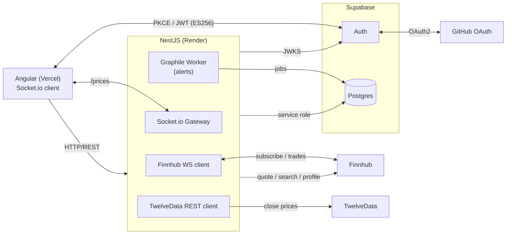

# pulseticker

Real-time stock monitoring dashboard with WebSocket price streaming and
threshold-based alerts. Built as a portfolio project to demonstrate OAuth2,
event-driven backends, and real-time UI updates.

## Features

- **Real-time prices** — Live stock quotes via Finnhub WebSocket (US market hours)
- **Price chart** — Interactive close-price line chart with 1D / 1Y timeframes (TwelveData)
- **Watchlist** — Add / remove symbols; prices stream automatically once subscribed
- **Price alerts** — Set threshold alerts; fires once then deactivates
- **Discover** — Search and preview US-listed symbols before adding to watchlist
- **GitHub OAuth** — Supabase PKCE flow; session persisted in-browser
- **Theme** — Light / dark mode toggle

## Architecture



## Stack

| Layer | Tech |
|---|---|
| Frontend | Angular 22 (standalone components, zoneless, signals) + Taiga UI 5.10 + lightweight-charts |
| Mobile | Expo SDK 57 + React Native 0.86 + Expo Router — scaffold only, see [apps/mobile](./apps/mobile/README.md) |
| Backend | NestJS 11 (Graphile Worker, Socket.io, terminus) |
| Auth | Supabase GitHub OAuth (PKCE, ES256 JWT verified via JWKS) |
| Database | Supabase Postgres with row-level security |
| Queue | Graphile Worker on Supabase PostgreSQL |
| Prices | Finnhub — WebSocket (live trades) + REST (quotes, search, company data); TwelveData REST (historical close prices) |
| Tooling | pnpm workspaces + Turborepo |

## Local setup

1. Copy `.env.example` → `.env` at the repo root. Required vars:
   ```
   SUPABASE_URL=                  # https://<ref>.supabase.co
   SUPABASE_SECRET_KEY=           # service role JWT
   SUPABASE_PUBLISHABLE_KEY=      # anon/publishable JWT (browser-safe)
   FINNHUB_API_KEY=
   TWELVEDATA_API_KEY=            # historical price data (free tier: 800 req/day)
   DATABASE_URL=                  # Supabase Session Pooler URI (port 5432)
   API_URL=http://localhost:3000
   WS_URL=http://localhost:3000
   CORS_ORIGIN=http://localhost:4200
   APP_ENV=development            # controls log verbosity: development | staging | production
   ```

2. Apply the database schema:
   ```
   npx supabase db push
   ```
   Or run each file in `supabase/migrations/` sequentially via the Supabase dashboard SQL editor.

3. ```
   pnpm install
   pnpm dev          # api on :3000, web on :4200
   ```

4. Log in with GitHub. Use the Watchlist screen to search for and add symbols.
   Prices stream during US market hours (EST 9:30–16:00).

## Tests

```
pnpm --filter api test:cov     # 150 tests / 22 suites — watchlist, alerts, gateway, queue, chart, preview
pnpm --filter web test:cov     # 158 tests / 18 suites — components, services, pipes, guards
```

`pnpm test` runs every workspace, mobile included. Mobile setup, checks and known
gaps are documented in [apps/mobile/README.md](./apps/mobile/README.md).

## Deployment

| Service | Setup |
|---|---|
| Render (api) | Root `apps/api`, build `pnpm install && pnpm run build`, start `node dist/main`. Set all env vars + `NODE_ENV=production`, `CORS_ORIGIN=<vercel-url>`. Add `DATABASE_URL` (Supabase Session Pooler URI). Graphile Worker auto-creates its schema on first boot. |
| Vercel (web) | Root `apps/web`, build `tsx scripts/set-env.ts --prod && ng build`, output `dist/web/browser`. Add `vercel.json` rewrites before first deploy. |
| Uptime monitor | UptimeRobot pings `https://pulseticker.onrender.com/health` every 13 min. Render's free tier sleeps after 15 min idle, so this keeps the demo instance from cold-starting on the first visit. `/health` must stay unauthenticated. |

Supabase Auth → URL Configuration → Redirect URLs must include
`<vercel-url>/auth/callback` (and `http://localhost:4200/auth/callback` for
local dev).

## Scope

- US-listed equities only (Finnhub free tier)
- Prices arrive only during US market hours; dashboard shows `—` otherwise
- One alert per row, fires once then deactivates (no re-arm logic)
- See [PLAN.md](./PLAN.md) for the full implementation plan and rationale
