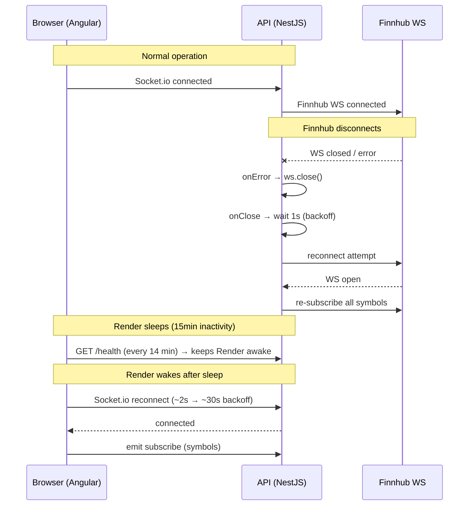

# REQ-08: WebSocket Auto-Reconnection Configuration

## Overview

Ensures that WebSocket connections recover automatically after a Render sleep wake-up or network interruption, preventing the app from appearing broken during demos.

Three mechanisms work in concert:

1. **NestJS** — Finnhub WebSocket reconnects with exponential backoff
2. **Angular** — Socket.io client reconnects with explicit options
3. **Angular** — `/health` ping every 14 minutes to prevent Render sleep

---

## 1. NestJS: Finnhub WebSocket Reconnection

**File:** `apps/api/src/finnhub/finnhub/finnhub.service.ts`

### Implementation

```typescript
private reconnectDelay = 1000;        // initial delay: 1s
private readonly maxDelay = 30000;    // cap: 30s

this.ws.on('open', () => {
  this.reconnectDelay = 1000;         // reset on successful connect
  for (const sym of this.subscriptions) {
    this.ws.send(JSON.stringify({ type: 'subscribe', symbol: sym }));
  }
});

this.ws.on('close', () => {
  setTimeout(() => {
    this.reconnectDelay = Math.min(this.reconnectDelay * 2, this.maxDelay);
    this.connect();
  }, this.reconnectDelay);
});

this.ws.on('error', (err) => {
  this.ws.close();                    // triggers the 'close' handler above
});
```

### Backoff Sequence

| Attempt | Delay |
| ------- | ----- |
| 1st     | 1s    |
| 2nd     | 2s    |
| 3rd     | 4s    |
| 4th     | 8s    |
| 5th     | 16s   |
| 6th+    | 30s   |

### Key Behaviours

- **Subscription restoration**: on reconnect, all tracked symbols are re-subscribed immediately in the `open` handler
- **Error delegation**: `onError` closes the socket rather than reconnecting directly, keeping reconnection logic in one place (`onClose`)
- **Delay reset**: `reconnectDelay` resets to 1s on every successful `open`, so a stable connection doesn't carry over a stale high delay

---

## 2. Angular: Socket.io Client Reconnection

**File:** `apps/web/src/app/core/services/socket.service.ts`

### Implementation

```typescript
this.socket = io(`${environment.wsUrl}/prices`, {
  auth: { token },
  transports: ["websocket"],
  reconnection: true,
  reconnectionDelay: 2000,
  reconnectionDelayMax: 30000,
  reconnectionAttempts: Infinity,
});
```

### Option Rationale

| Option                 | Value      | Reason                                                          |
| ---------------------- | ---------- | --------------------------------------------------------------- |
| `reconnection`         | `true`     | Explicit intent; does not rely on Socket.io's default           |
| `reconnectionDelay`    | `2000ms`   | Starts at 2s; avoids hammering a server that is still waking up |
| `reconnectionDelayMax` | `30000ms`  | Aligned with Render's cold-start window (~10–30s)               |
| `reconnectionAttempts` | `Infinity` | Retries indefinitely; essential for unattended demo resilience  |

### Effective Delay Sequence

Socket.io applies an internal jitter via `randomizationFactor: 0.5` (default). The actual delay sequence is approximately:

```
~2s → ~4s → ~8s → ~16s → ~30s → ~30s → ...
```

This mirrors the NestJS backoff cap of 30s, ensuring both ends converge to the same steady-state retry cadence during a Render wake-up.

---

## 3. Angular: Render Keep-Alive Ping

**File:** `apps/web/src/app/app.ts`

### Implementation

```typescript
const KEEPALIVE_INTERVAL_MS = 14 * 60 * 1000; // 14 minutes

constructor() {
  setInterval(() => {
    fetch(`${environment.apiUrl}/health`).catch(() => {});
  }, KEEPALIVE_INTERVAL_MS);
}
```

**Endpoint:** `GET /health` (`apps/api/src/health/health/health.controller.ts`)

The `/health` endpoint is powered by `@nestjs/terminus` and checks:

- Supabase connectivity
- Heap memory usage (< 200 MB)

### Why 14 Minutes

Render's free tier sleeps after **15 minutes** of inactivity. Pinging at 14 minutes provides a 1-minute buffer.

> [!NOTE]
> Browser `setInterval` can be throttled when a tab is in the background. The 1-minute buffer accommodates minor drift. If stricter keep-alive is required, consider a server-side cron instead.

---

## Reconnection Flow



---

## Implementation Status

| Requirement                                     | Status  | File                   |
| ----------------------------------------------- | ------- | ---------------------- |
| NestJS `onClose` exponential backoff            | ✅ Done | `finnhub.service.ts`   |
| NestJS `onError` handler                        | ✅ Done | `finnhub.service.ts`   |
| NestJS subscription restoration on reconnect    | ✅ Done | `finnhub.service.ts`   |
| Angular Socket.io explicit reconnection options | ✅ Done | `socket.service.ts`    |
| Angular `/health` ping (14-min interval)        | ✅ Done | `app.ts`               |
| `/health` endpoint (NestJS)                     | ✅ Done | `health.controller.ts` |
